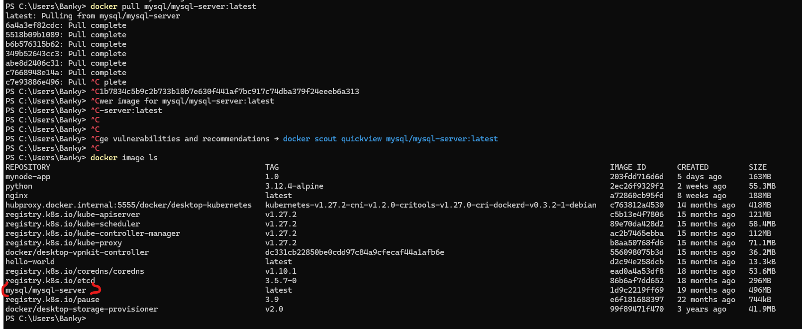

## **Documentation for Project 20**
## **Migration to the Сloud with containerization. Part 1 - Docker & Docker Compose**

### Assembling our application from the Database Layer by making use of a prebuilt Mysql Database Container available on docker hub registry and configuring it to receive requests from our php application.

`docker pull mysql/mysql-server:latest`

