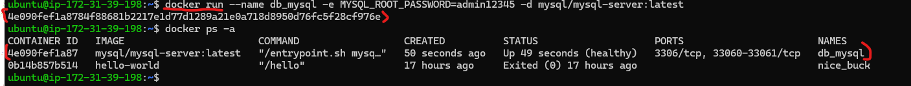
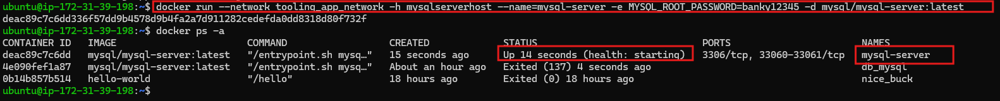

## **Documentation for Project 20**
## **Migration to the Сloud with containerization. Part 1 - Docker & Docker Compose**

### Assembling our application from the Database Layer by making use of a prebuilt Mysql Database Container available on docker hub registry and configuring it to receive requests from our php application.

`docker pull mysql/mysql-server:latest`

### Deploying the MySQL Container to my Docker Engine by running the mysql image as a container

`docker run --name db_mysql -e MYSQL_ROOT_PASSWORD=admin12345 -d mysql/mysql-server:latest`

`docker ps -a`

### Connecting to the mysql Docker Container in two different ways: METHOD 1. By connecting directly to the container running the mysql server

`docker exec -it db_mysql mysql -uroot -p`

### Changing the mysql server root password to protect our database

`ALTER USER 'root'@'localhost' IDENTIFIED BY 'banky12345';`

`FLUSH PRIVILEGES;`

### Connecting to the mysql Docker Container in two different ways: METHOD 2. By connecting to the mysql server container on a bridge network

### Creating a Bridge Network where our container will run our application

`docker network create --subnet=172.18.0.0/24 tooling_app_network`

### Now we are going to run the MYSQL Server in a Container on the Bridge Network we created for our application and create an environment variable to store our Mysql root password

`docker run --network tooling_app_network -h mysqlserverhost --name=mysql-server -e MYSQL_ROOT_PASSWORD=banky12345  -d mysql/mysql-server:latest`

### Mysql script to create a new user to connect to the Mysql server remotely instead of using the root user

` " CREATE USER 'banky'@'%' IDENTIFIED BY 'banky12345';
GRANT ALL PRIVILEGES ON * . * TO 'banky'@'%'; " `

### Exporting our root password MYSQL_PW environment variable for the container to be able to access it

`export MYSQL_PW='banky12345'`

### Testing our new user access to the container

`docker exec -i mysql-server mysql -uroot -p$MYSQL_PW < ./create_user.sql`

### Connecting to the Mysql server from the second container that has the mysql client running on it. We pulled down the mysql client image from docker hub on the tooling-app bridge network we created and connecting to the mysql-server.

`docker run --network tooling_app_network --name mysql-client -it --rm mysql mysql -h mysqlserverhost -u banky -p`

### Preparing a Database schema that our tooling application will connect to for data storage.

### Cloning down our tooling app.

`git clone https://github.com/dareyio/tooling.git`

### Exporting the location of our sql file for the container to be able to access it.

`export tooling_db_schema=~/tooling/html/tooling_db_schema.sql`

### Executing a command in the running container.

`docker exec -i mysql-server mysql -uroot -p$MYSQL_PW < $tooling_db_schema
`

## Containerizing our tooling app.

### Building our Dockerfile which has been updated with the latest version of php, which is the base image

`docker build . -t tooling:0.0.1`

### Running our Docker image which we have just built in a container on the same bridge network with the database so they can communicate with each other.

`docker run --name=banky_tooling-app --network tooling_app_network -p=8085:80 -d -it tooling:0.0.1 bash`

`docker ps`

### Tooling App Live on port 8085 after starting apache2 server in the container and some troubleshooting.

`docker ps`

## Practice Task
